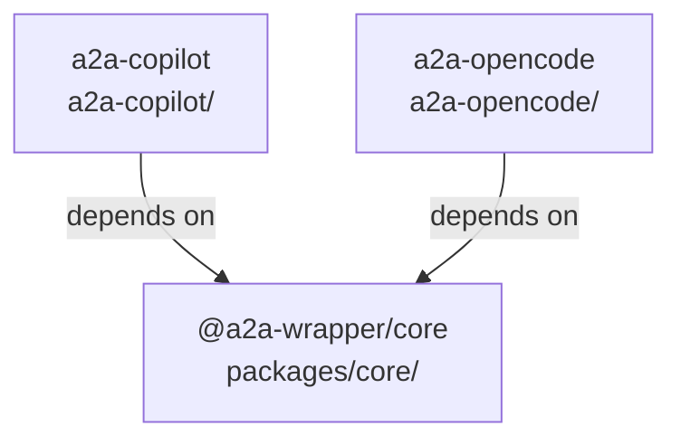

# Design Document: Monorepo Restructure

## Overview

This design restructures the a2a-wrapper project from a collection of independently-managed packages (each with their own `.git`, CI workflows, community docs, and lock files) into a proper npm workspaces monorepo orchestrated by Turborepo, with Changesets for independent versioning and publishing.

The restructure is purely a repository-level concern — no runtime code changes, no API changes, no breaking changes for npm consumers. The three packages (`@a2a-wrapper/core`, `a2a-copilot`, `a2a-opencode`) keep their names, directory locations, and public APIs intact.

Key tools:
- **npm workspaces** — dependency hoisting, single `npm install`, cross-package linking
- **Turborepo** — dependency-aware task ordering, output caching, parallel execution
- **Changesets** — independent versioning, automated changelog generation, publish automation

## Architecture

```
a2a-wrapper/                          ← repository root
├── package.json                      ← root: private, workspaces, turbo scripts
├── package-lock.json                 ← single lock file for all packages
├── turbo.json                        ← pipeline: build, test, typecheck, clean
├── .changeset/
│   └── config.json                   ← independent versioning config
├── .github/
│   └── workflows/
│       ├── ci.yml                    ← unified CI using turbo run
│       └── publish.yml               ← changesets publish workflow
├── .gitignore                        ← combined root gitignore
├── README.md                         ← monorepo overview (already exists)
├── CONTRIBUTING.md                   ← monorepo-aware contributing guide
├── CODE_OF_CONDUCT.md                ← consolidated from packages
├── SECURITY.md                       ← consolidated from packages
├── LICENSE                           ← consolidated from packages
├── packages/
│   └── core/                         ← @a2a-wrapper/core (unchanged path)
│       ├── package.json
│       ├── tsconfig.json
│       ├── README.md
│       ├── CHANGELOG.md
│       └── src/
├── a2a-copilot/                      ← a2a-copilot (unchanged path)
│   ├── package.json
│   ├── tsconfig.json
│   ├── README.md
│   ├── CHANGELOG.md
│   └── src/
└── a2a-opencode/                     ← a2a-opencode (unchanged path)
    ├── package.json
    ├── tsconfig.json
    ├── README.md
    ├── CHANGELOG.md
    └── src/
```

### Dependency graph (Turborepo build order)



Turborepo's `^build` dependency ensures `@a2a-wrapper/core` builds first, then both wrappers build in parallel.

## Components and Interfaces

### 1. Root `package.json`

The root package.json ties everything together. It is `private: true` (never published), declares workspace globs, and delegates all scripts to Turborepo.

```json
{
  "name": "a2a-wrapper",
  "version": "0.0.0",
  "private": true,
  "description": "Monorepo for A2A protocol wrappers",
  "workspaces": [
    "packages/*",
    "a2a-*"
  ],
  "scripts": {
    "build": "turbo run build",
    "test": "turbo run test",
    "typecheck": "turbo run typecheck",
    "clean": "turbo run clean",
    "changeset": "changeset",
    "version-packages": "changeset version",
    "release": "turbo run build && changeset publish"
  },
  "devDependencies": {
    "@changesets/cli": "^2.27.0",
    "turbo": "^2.5.0"
  },
  "engines": {
    "node": ">=18.0.0"
  }
}
```

The `workspaces` globs `["packages/*", "a2a-*"]` auto-discover:
- `packages/core/` → `@a2a-wrapper/core`
- `a2a-copilot/` → `a2a-copilot`
- `a2a-opencode/` → `a2a-opencode`
- Any future `a2a-*` directory → auto-included

### 2. Turborepo Configuration (`turbo.json`)

```json
{
  "$schema": "https://turbo.build/schema.json",
  "tasks": {
    "build": {
      "dependsOn": ["^build"],
      "outputs": ["dist/**"]
    },
    "typecheck": {
      "dependsOn": ["^build"],
      "outputs": []
    },
    "test": {
      "dependsOn": ["^build"],
      "outputs": []
    },
    "clean": {
      "cache": false
    }
  }
}
```

Design decisions:
- `build` depends on `^build` — upstream packages (core) build before downstream (wrappers)
- `outputs: ["dist/**"]` — Turborepo caches build artifacts; unchanged packages skip rebuild
- `typecheck` and `test` depend on `^build` so that core's `.d.ts` files exist before wrappers type-check
- `clean` has `cache: false` — always runs, never cached

### 3. Changesets Configuration (`.changeset/config.json`)

```json
{
  "$schema": "https://unpkg.com/@changesets/config@3.1.1/schema.json",
  "changelog": "@changesets/cli/changelog",
  "commit": false,
  "fixed": [],
  "linked": [],
  "access": "public",
  "baseBranch": "main",
  "updateInternalDependencies": "patch",
  "ignore": []
}
```

Design decisions:
- `fixed: []` — independent versioning; each package has its own version
- `linked: []` — no linked version groups; core can release without wrappers
- `access: "public"` — all packages are public on npm
- `updateInternalDependencies: "patch"` — when core bumps, wrappers that depend on it get their dependency range updated
- `commit: false` — changesets don't auto-commit; the PR flow handles it

### 4. CI Workflow (`.github/workflows/ci.yml`)

```yaml
name: CI

on:
  push:
    branches: [main]
  pull_request:
    branches: [main]

concurrency:
  group: ${{ github.workflow }}-${{ github.ref }}
  cancel-in-progress: true

jobs:
  build-and-test:
    name: Build, Typecheck & Test
    runs-on: ubuntu-latest

    strategy:
      matrix:
        node-version: [18.x, 20.x, 22.x]

    steps:
      - name: Checkout
        uses: actions/checkout@v4

      - name: Set up Node.js ${{ matrix.node-version }}
        uses: actions/setup-node@v4
        with:
          node-version: ${{ matrix.node-version }}
          cache: npm

      - name: Install dependencies
        run: npm ci

      - name: Build, typecheck, and test
        run: npx turbo run build typecheck test
```

Design decisions:
- Single `turbo run build typecheck test` command handles ordering, caching, and parallelism
- `concurrency` group cancels in-progress runs on the same branch (saves CI minutes)
- Tests against Node 18, 20, 22 (matching existing CI matrices)
- `npm ci` at root installs all workspace dependencies

### 5. Publish Workflow (`.github/workflows/publish.yml`)

```yaml
name: Publish

on:
  push:
    branches: [main]

jobs:
  release:
    name: Release
    runs-on: ubuntu-latest
    permissions:
      contents: write
      pull-requests: write
      id-token: write

    steps:
      - name: Checkout
        uses: actions/checkout@v4

      - name: Set up Node.js
        uses: actions/setup-node@v4
        with:
          node-version: 20.x
          registry-url: https://registry.npmjs.org
          cache: npm

      - name: Install dependencies
        run: npm ci

      - name: Build all packages
        run: npx turbo run build

      - name: Create Release PR or Publish
        uses: changesets/action@v1
        with:
          publish: npx changeset publish
          title: "chore: version packages"
          commit: "chore: version packages"
        env:
          GITHUB_TOKEN: ${{ secrets.GITHUB_TOKEN }}
          NODE_AUTH_TOKEN: ${{ secrets.NPM_TOKEN }}
          NPM_CONFIG_PROVENANCE: true
```

Design decisions:
- Runs on every push to `main` — the Changesets action is idempotent
- When pending changesets exist → creates/updates a "Version Packages" PR
- When that PR is merged (no pending changesets, but version bumps) → publishes to npm
- `NPM_CONFIG_PROVENANCE: true` enables npm provenance (replaces `--provenance` flag)
- `contents: write` + `pull-requests: write` for the Changeset PR; `id-token: write` for provenance

### 6. Root `.gitignore`

Combined from both existing `.gitignore` files plus monorepo-specific entries:

```gitignore
# Dependencies
node_modules/

# Build output
dist/

# Logs
*.log
nohup.out
logs/

# Environment
.env
.env.*
!.env.example

# Runtime / PIDs
*.pid

# macOS
.DS_Store

# Editor
.vscode/
.idea/
*.swp
*.swo

# Test coverage
coverage/

# npm pack artifacts
*.tgz

# Turborepo
.turbo/
```

The two existing `.gitignore` files are identical, so the combined version is the same content plus `.turbo/`.

### 7. Root Community Documents

**`CONTRIBUTING.md`** — rewritten for monorepo workflow:
- References Turborepo commands (`npx turbo run build`, `npx turbo run test`)
- Documents the changeset workflow (`npx changeset` to create a changeset, PR flow)
- Explains workspace structure and how to work on specific packages
- Documents how to add a new wrapper

**`CODE_OF_CONDUCT.md`** — copied from existing (both packages have identical content, Contributor Covenant v2.1).

**`SECURITY.md`** — adapted from existing, updated to reference the monorepo repository URL and cover all packages.

**`LICENSE`** — MIT license, copied from existing (identical across packages).

### 8. Workspace Package Updates

Each wrapper's `package.json` needs minor updates:

- Remove `prepublishOnly` script (Turborepo + Changesets handles build-before-publish)
- Ensure `repository.directory` field points to the correct subdirectory
- Ensure `homepage` and `bugs` URLs reference the monorepo
- Keep `test` script as `vitest` (not `vitest --run`) for local dev; CI uses turbo which respects the script

The `@a2a-wrapper/core` package.json already has the correct `exports` field with `types` + `import` conditions. No changes needed.

### 9. TypeScript Configuration

All three packages already share identical `tsconfig.json` settings:

```jsonc
{
  "compilerOptions": {
    "target": "ES2022",
    "module": "NodeNext",
    "moduleResolution": "NodeNext",
    "lib": ["ES2022"],
    "outDir": "./dist",
    "rootDir": "./src",
    "strict": true,
    "esModuleInterop": true,
    "skipLibCheck": true,
    "forceConsistentCasingInFileNames": true,
    "declaration": true,
    "declarationMap": true,
    "sourceMap": true,
    "resolveJsonModule": true
  },
  "include": ["src/**/*"],
  "exclude": ["node_modules", "dist", "**/__tests__/**"]
}
```

No changes needed. Each package keeps its own `tsconfig.json` — no root tsconfig with project references (unnecessary complexity for this repo size).

## Data Models

This feature does not introduce new runtime data models. All changes are to repository configuration files (JSON, YAML, Markdown). The relevant "data shapes" are the configuration schemas:

### Root `package.json` schema (relevant fields)

| Field | Type | Value |
|---|---|---|
| `name` | string | `"a2a-wrapper"` |
| `private` | boolean | `true` |
| `workspaces` | string[] | `["packages/*", "a2a-*"]` |
| `scripts` | object | Delegates to `turbo run` |
| `devDependencies` | object | `turbo`, `@changesets/cli` |
| `engines.node` | string | `">=18.0.0"` |

### `turbo.json` task schema

| Task | `dependsOn` | `outputs` | `cache` |
|---|---|---|---|
| `build` | `["^build"]` | `["dist/**"]` | default (true) |
| `typecheck` | `["^build"]` | `[]` | default (true) |
| `test` | `["^build"]` | `[]` | default (true) |
| `clean` | — | — | `false` |

### `.changeset/config.json` schema

| Field | Value | Rationale |
|---|---|---|
| `changelog` | `"@changesets/cli/changelog"` | Default changelog format |
| `commit` | `false` | Let PR flow handle commits |
| `fixed` | `[]` | Independent versioning |
| `linked` | `[]` | No linked groups |
| `access` | `"public"` | All packages are public |
| `baseBranch` | `"main"` | Default branch |
| `updateInternalDependencies` | `"patch"` | Auto-update dep ranges |


## Correctness Properties

*A property is a characteristic or behavior that should hold true across all valid executions of a system — essentially, a formal statement about what the system should do. Properties serve as the bridge between human-readable specifications and machine-verifiable correctness guarantees.*

This feature is primarily a repository restructure — configuration files, CI workflows, and documentation. Most acceptance criteria are concrete "this file must exist with this content" checks (examples), not universal properties over generated inputs. The one genuine property applies to the consistency of TypeScript configuration across all workspace packages.

### Property 1: TypeScript configuration consistency across all workspace packages

*For any* workspace package in the monorepo (discovered by the `workspaces` globs in root `package.json`), its `tsconfig.json` SHALL use `"module": "NodeNext"`, `"moduleResolution": "NodeNext"`, and `"target": "ES2022"` (or later), and SHALL have `"declaration": true`, `"declarationMap": true`, and `"sourceMap": true`.

**Validates: Requirements 11.4, 11.5, 11.2, 11.3**

### Property 2: Workspace package publish configuration consistency

*For any* workspace package in the monorepo, its `package.json` SHALL have a `version` field (string matching semver), a `publishConfig.access` field set to `"public"`, and a `files` array specifying which files to include in the published package.

**Validates: Requirements 8.1, 8.2, 8.4, 8.5, 8.6**

### Property 3: No duplicate artifacts in wrapper directories

*For any* wrapper directory matching the `a2a-*` glob pattern, that directory SHALL NOT contain any of: `.git/`, `.github/`, `.gitignore`, `package-lock.json`, `CONTRIBUTING.md`, `CODE_OF_CONDUCT.md`, `SECURITY.md`, or `LICENSE`.

**Validates: Requirements 9.1, 9.2, 3.5, 3.6, 5.8, 5.9, 6.2, 6.3, 6.6, 6.7, 7.2, 7.3**

## Error Handling

This feature is a repository restructure with no runtime code changes. Error scenarios are limited to:

1. **`npm install` fails at root** — If workspace globs don't match expected directories, npm will warn but not fail. The CI workflow validates this by running `npm ci` which fails on any resolution error.

2. **Turborepo build ordering fails** — If a wrapper's `package.json` doesn't declare `@a2a-wrapper/core` as a dependency, Turborepo won't know to build core first. The `^build` dependency in `turbo.json` only works when the npm dependency graph is correct. Mitigation: each wrapper must list `@a2a-wrapper/core` in `dependencies` or `peerDependencies`.

3. **Changesets publish fails** — If `NPM_TOKEN` secret is not set or expired, the publish step fails. The workflow uses `NODE_AUTH_TOKEN` which is standard. Mitigation: the Changeset PR is created separately from publishing, so a token issue doesn't block version bumping.

4. **Stale `.git` directories** — If the per-package `.git/` directories are not removed, git may behave unexpectedly (nested repos). Mitigation: explicit removal step in the task list, validated by Property 3.

5. **Missing `package-lock.json` at root** — After removing per-package lock files, if `npm install` is not run at root, there will be no lock file. Mitigation: the first task after cleanup is running `npm install` to generate the root lock file.

## Testing Strategy

### Dual Testing Approach

This feature requires both example-based tests and property-based tests:

- **Example tests (unit tests)**: Validate specific file existence, specific field values in JSON configs, specific content in YAML workflows. These cover the majority of acceptance criteria since most are concrete "file X must contain Y" checks.
- **Property tests**: Validate universal invariants that must hold across all workspace packages (tsconfig consistency, publish config consistency, no duplicate artifacts).

### Property-Based Testing Configuration

- **Library**: [fast-check](https://github.com/dubzzz/fast-check) (already a devDependency in `@a2a-wrapper/core`)
- **Minimum iterations**: 100 per property test
- **Tag format**: `Feature: monorepo-restructure, Property {number}: {property_text}`

For this feature, property-based tests will generate the set of workspace packages dynamically (by reading the workspace globs and resolving them) and then assert invariants across all discovered packages. This means adding a new `a2a-*` wrapper automatically gets covered by the property tests.

### Example Tests

Example tests validate specific configuration values:

1. Root `package.json` has `private: true`, correct `workspaces` globs, correct `scripts`, correct `devDependencies`
2. `turbo.json` has correct task definitions with `^build` dependency and output caching
3. `.changeset/config.json` has `fixed: []`, `access: "public"`, `baseBranch: "main"`
4. `.github/workflows/ci.yml` uses `turbo run`, tests Node 18/20/22, uses `npm ci`
5. `.github/workflows/publish.yml` uses `changesets/action`, has provenance enabled
6. Root `.gitignore` includes `.turbo/` entry
7. Root community docs exist (`CONTRIBUTING.md`, `CODE_OF_CONDUCT.md`, `SECURITY.md`, `LICENSE`)
8. `CONTRIBUTING.md` references turbo commands and changeset workflow
9. Each package retains its own `README.md` and `CHANGELOG.md`

### Property Tests

Each correctness property maps to a single property-based test:

1. **Feature: monorepo-restructure, Property 1: TypeScript configuration consistency** — For all discovered workspace packages, validate tsconfig settings
2. **Feature: monorepo-restructure, Property 2: Workspace package publish configuration** — For all discovered workspace packages, validate package.json publish fields
3. **Feature: monorepo-restructure, Property 3: No duplicate artifacts in wrappers** — For all `a2a-*` directories, validate absence of consolidated files
