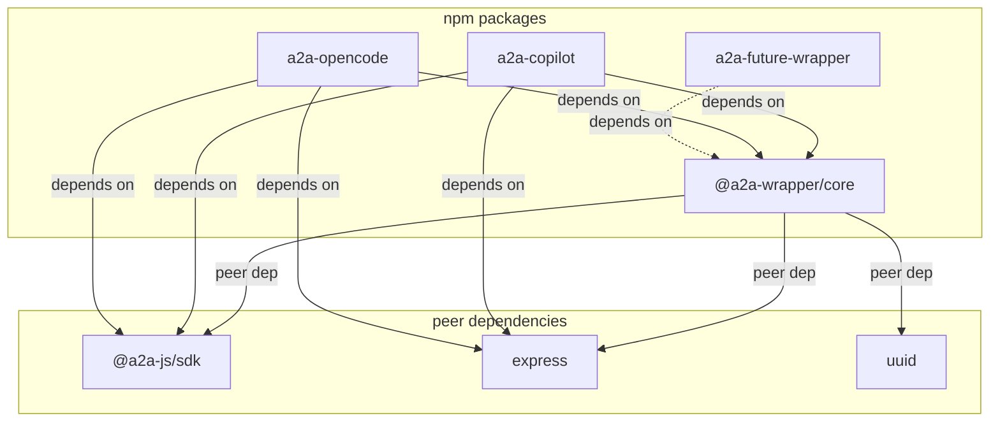
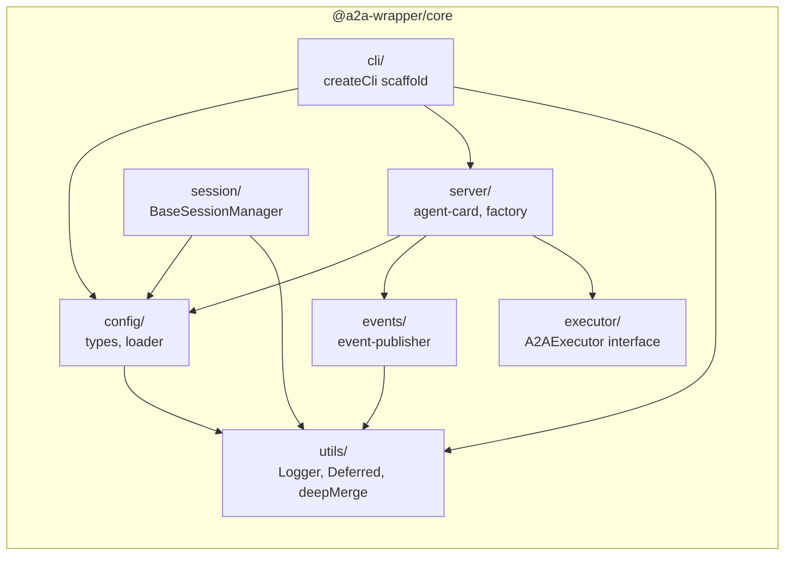
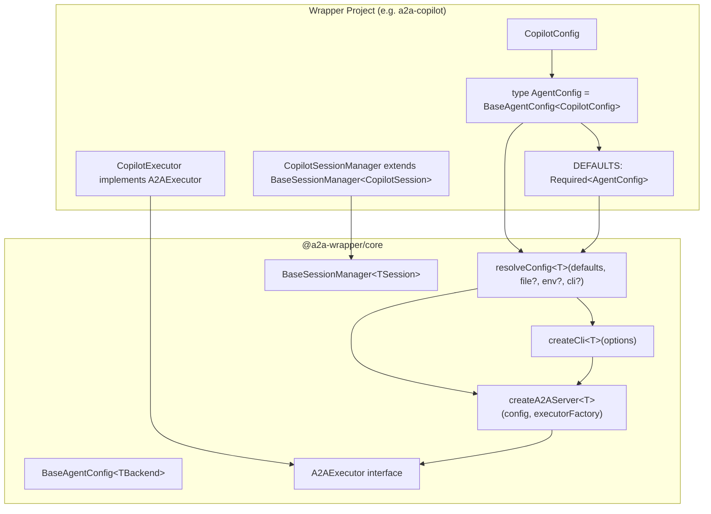

# Design Document: @a2a-wrapper/core

## Overview

This document describes the technical design for extracting shared infrastructure code from two A2A protocol wrapper projects (`a2a-copilot` and `a2a-opencode`) into a reusable `@a2a-wrapper/core` npm package. Both projects follow an identical architectural pattern — wrapping a backend AI system behind a fully A2A-spec-compliant HTTP server — and share near-identical implementations of 10+ modules.

The core package centralizes all protocol-level, server-level, and utility code so that each wrapper project retains only its backend-specific executor, config section, and thin CLI layer. A TypeScript generics approach (`BaseAgentConfig<TBackend>`) allows each wrapper to plug in its own backend config type while sharing the entire infrastructure stack.

### Design Goals

- Eliminate ~80% code duplication between wrapper projects
- Centralize A2A spec compliance in a single package
- Enable new wrapper projects with ~3 files (executor, config, CLI)
- Maintain strict TypeScript, CMMI Level 5 documentation standards
- Preserve backward compatibility with existing wrapper APIs

### Key Design Decision: Generics Over Inheritance

Both wrapper projects share identical infrastructure but differ in their backend config section (`CopilotConfig` vs `OpenCodeConfig`). Rather than using class inheritance or runtime polymorphism, the design uses TypeScript generic type parameters threaded through the config loader, server factory, CLI scaffold, and session manager. This provides:

1. Full type safety — each wrapper gets autocomplete and type checking for its backend fields
2. Zero runtime overhead — generics are erased at compile time
3. No coupling — the core package has no knowledge of any specific backend

## Architecture

### Package Dependency Graph



### Module Architecture



### Core Package Directory Structure

```
packages/core/
├── src/
│   ├── index.ts                  # Public API barrel export
│   ├── utils/
│   │   ├── logger.ts             # Logger class, LogLevel enum, createLogger factory
│   │   ├── deferred.ts           # Deferred<T>, createDeferred, sleep
│   │   └── deep-merge.ts         # deepMerge, substituteEnvTokens
│   ├── config/
│   │   ├── types.ts              # BaseAgentConfig<T>, AgentCardConfig, ServerConfig, etc.
│   │   └── loader.ts             # loadConfigFile, resolveConfig<T>
│   ├── events/
│   │   └── event-publisher.ts    # publishStatus, publishFinalArtifact, etc.
│   ├── server/
│   │   ├── agent-card.ts         # buildAgentCard
│   │   └── factory.ts            # createA2AServer<T>
│   ├── session/
│   │   └── base-session-manager.ts  # BaseSessionManager<TSession>
│   ├── executor/
│   │   └── types.ts              # A2AExecutor interface
│   └── cli/
│       └── scaffold.ts           # createCli<T>
├── package.json
├── tsconfig.json
├── README.md
└── CHANGELOG.md
```

### Wrapper Project Structure (After Extraction)

```
a2a-copilot/
├── src/
│   ├── index.ts                  # Re-exports from core + copilot-specific
│   ├── cli.ts                    # ~30 lines: createCli({ parseBackendArgs, ... })
│   ├── config/
│   │   ├── types.ts              # CopilotConfig interface only
│   │   └── defaults.ts           # DEFAULTS with CopilotConfig section
│   └── copilot/
│       ├── executor.ts           # CopilotExecutor implements A2AExecutor
│       ├── session-manager.ts    # extends BaseSessionManager<CopilotSession>
│       └── mcp-hooks.ts          # Copilot-specific MCP evidence hooks
```

## Components and Interfaces

### Generic Type System

The central design pattern is a generic type parameter `TBackend` that flows through the entire stack:

```typescript
/**
 * Base configuration interface parameterized by backend-specific config.
 *
 * @typeParam TBackend - The wrapper-specific configuration section.
 *   For a2a-copilot this is CopilotConfig; for a2a-opencode this is OpenCodeConfig.
 *
 * @example
 * // In a2a-copilot:
 * type CopilotAgentConfig = BaseAgentConfig<CopilotConfig>;
 *
 * // In a2a-opencode:
 * type OpenCodeAgentConfig = BaseAgentConfig<OpenCodeConfig>;
 */
export interface BaseAgentConfig<TBackend = Record<string, unknown>> {
  /** Agent card identity & capabilities */
  agentCard: AgentCardConfig;
  /** Network / server settings */
  server: ServerConfig;
  /** Backend-specific configuration (CopilotConfig, OpenCodeConfig, etc.) */
  backend: TBackend;
  /** Session management */
  session: SessionConfig;
  /** Feature flags (extend BaseFeatureFlags in wrapper) */
  features: BaseFeatureFlags;
  /** Timeout settings */
  timeouts: TimeoutConfig;
  /** Logging settings */
  logging: LoggingConfig;
  /** MCP server configurations */
  mcp: Record<string, BaseMcpServerConfig>;
}
```

This generic parameter threads through:

```typescript
// Config loader — preserves the full config type through the merge pipeline
function resolveConfig<T extends BaseAgentConfig<unknown>>(
  defaults: Required<T>,
  configFilePath?: string,
  envOverrides?: Partial<T>,
  cliOverrides?: Partial<T>,
): Required<T>;

// Server factory — passes the typed config to the executor factory
function createA2AServer<T extends BaseAgentConfig<unknown>>(
  config: Required<T>,
  executorFactory: (config: Required<T>) => A2AExecutor,
  options?: ServerOptions,
): Promise<ServerHandle>;

// CLI scaffold — threads the type through the entire boot sequence
function createCli<T extends BaseAgentConfig<unknown>>(
  options: CliOptions<T>,
): void;

// Session manager — parameterized by the session object type
abstract class BaseSessionManager<TSession> { ... }
```

### Component: Logger (`utils/logger.ts`)

```typescript
/**
 * Log severity levels, ordered from most verbose (DEBUG=0) to least (ERROR=3).
 * Used by Logger.setLevel() to control minimum output threshold.
 */
export enum LogLevel {
  DEBUG = 0,
  INFO = 1,
  WARN = 2,
  ERROR = 3,
}

/**
 * Structured, leveled logger with hierarchical child logger support.
 *
 * Output format: [ISO_timestamp] [LEVEL] [name] message {data}
 * - ERROR routes to console.error
 * - WARN routes to console.warn
 * - DEBUG and INFO route to console.log
 *
 * Child loggers inherit the parent's level and format names as "parent:child".
 */
export class Logger {
  constructor(name: string, level?: LogLevel);

  /** Change the minimum log level at runtime. */
  setLevel(level: LogLevel): void;

  /** Parse a string level name (e.g. "debug", "info") into a LogLevel enum value. */
  static parseLevel(str: string): LogLevel;

  /** Create a child logger with name formatted as "{parent}:{childName}". */
  child(childName: string): Logger;

  debug(msg: string, data?: Record<string, unknown>): void;
  info(msg: string, data?: Record<string, unknown>): void;
  warn(msg: string, data?: Record<string, unknown>): void;
  error(msg: string, data?: Record<string, unknown>): void;
}

/**
 * Factory function for creating a root logger with a custom name.
 * Each wrapper project calls this once to get its own root logger instance.
 *
 * @param rootName - The root logger name (e.g. "a2a-copilot", "a2a-opencode")
 * @returns A new Logger instance with the given root name
 */
export function createLogger(rootName: string): Logger;
```

### Component: Promise Utilities (`utils/deferred.ts`)

```typescript
/**
 * A deferred promise — resolve/reject from outside the promise constructor.
 * Used extensively in streaming event handlers where the completion signal
 * arrives asynchronously from a different code path.
 */
export interface Deferred<T> {
  /** The underlying promise. */
  promise: Promise<T>;
  /** Resolve the promise with a value. */
  resolve: (value: T) => void;
  /** Reject the promise with a reason. */
  reject: (reason?: unknown) => void;
}

/** Create a new Deferred<T> instance. */
export function createDeferred<T>(): Deferred<T>;

/** Return a promise that resolves after the specified milliseconds. */
export function sleep(ms: number): Promise<void>;
```

### Component: Deep Merge (`utils/deep-merge.ts`)

```typescript
/**
 * Recursively merge source into target, producing a new object.
 *
 * Rules:
 * - Arrays are replaced (not concatenated)
 * - Neither input is mutated
 * - undefined values in source are skipped
 * - null values in source replace the target value
 * - Nested objects are recursively merged
 *
 * @param target - The base object
 * @param source - The override object
 * @returns A new merged object
 */
export function deepMerge<T extends Record<string, unknown>>(
  target: T,
  source: Partial<T>,
): T;

/**
 * Replace $VAR_NAME tokens in string arrays with matching environment
 * variable values. Unmatched tokens are left unchanged.
 *
 * @param args - Array of strings potentially containing $VAR_NAME tokens
 * @returns New array with tokens substituted
 */
export function substituteEnvTokens(args: string[]): string[];
```

### Component: Base Configuration Types (`config/types.ts`)

```typescript
/** A single skill exposed on the agent card. */
export interface SkillConfig {
  id: string;
  name: string;
  description: string;
  tags?: string[];
  examples?: string[];
}

/** Agent identity and capabilities advertised via the A2A Agent Card. */
export interface AgentCardConfig {
  name: string;
  description: string;
  protocolVersion?: string;
  version?: string;
  skills?: SkillConfig[];
  defaultInputModes?: string[];
  defaultOutputModes?: string[];
  streaming?: boolean;
  pushNotifications?: boolean;
  /** @deprecated Not implemented in A2A v1.0. Always false. */
  stateTransitionHistory?: boolean;
  provider?: { organization: string; url?: string };
}

/** Network and server settings. */
export interface ServerConfig {
  port?: number;
  hostname?: string;
  advertiseHost?: string;
  advertiseProtocol?: "http" | "https";
}

/** Session lifecycle management. */
export interface SessionConfig {
  titlePrefix?: string;
  reuseByContext?: boolean;
  ttl?: number;
  cleanupInterval?: number;
}

/** Base feature flags shared across all wrappers. */
export interface BaseFeatureFlags {
  streamArtifactChunks?: boolean;
}

/** Timeout settings. */
export interface TimeoutConfig {
  prompt?: number;
  pollingInterval?: number;
  healthCheck?: number;
}

/** Logging settings. */
export interface LoggingConfig {
  level?: string;
}

/** Base MCP server config with type discriminator. */
export interface BaseMcpServerConfig {
  type: string;
  enabled?: boolean;
}

/**
 * Base agent configuration parameterized by backend-specific config.
 * @typeParam TBackend - Wrapper-specific config (CopilotConfig, OpenCodeConfig, etc.)
 */
export interface BaseAgentConfig<TBackend = Record<string, unknown>> {
  agentCard: AgentCardConfig;
  server: ServerConfig;
  backend: TBackend;
  session: SessionConfig;
  features: BaseFeatureFlags;
  timeouts: TimeoutConfig;
  logging: LoggingConfig;
  mcp: Record<string, BaseMcpServerConfig>;
}
```

### Component: Configuration Loader (`config/loader.ts`)

```typescript
/**
 * Read and parse a JSON config file.
 * @throws Error with absolute file path and underlying message on failure.
 */
export function loadConfigFile<T>(filePath: string): T;

/**
 * Build the final resolved configuration by merging layers:
 *   defaults ← configFile ← envOverrides ← cliOverrides
 *
 * @typeParam T - The full config type (extends BaseAgentConfig)
 * @param defaults - Complete default config object
 * @param configFilePath - Optional path to a JSON config file
 * @param envOverrides - Optional partial config from environment variables
 * @param cliOverrides - Optional partial config from CLI arguments
 * @returns Fully resolved config with all fields populated
 */
export function resolveConfig<T extends BaseAgentConfig<unknown>>(
  defaults: Required<T>,
  configFilePath?: string,
  envOverrides?: Partial<T>,
  cliOverrides?: Partial<T>,
): Required<T>;
```

### Component: Agent Card Builder (`server/agent-card.ts`)

```typescript
/**
 * Construct an A2A AgentCard from resolved configuration.
 *
 * Computes endpoint URLs from ServerConfig (advertiseProtocol, advertiseHost, port),
 * maps SkillConfig arrays to A2A skill format, and sets capability flags.
 * stateTransitionHistory is always set to false per A2A v1.0 spec.
 *
 * @param config - Resolved config containing agentCard and server sections
 * @returns A fully populated A2A AgentCard object
 */
export function buildAgentCard(
  config: { agentCard: AgentCardConfig; server: ServerConfig },
): AgentCard;
```

### Component: Event Publisher (`events/event-publisher.ts`)

```typescript
/** Publish a task status-update event with optional agent message. */
export function publishStatus(
  bus: ExecutionEventBus,
  taskId: string,
  contextId: string,
  state: TaskState,
  messageText?: string,
  final?: boolean,
): void;

/** Publish a complete, non-appending artifact (buffered mode). */
export function publishFinalArtifact(
  bus: ExecutionEventBus, taskId: string, contextId: string, text: string,
): void;

/** Publish a streaming artifact chunk (append mode). */
export function publishStreamingChunk(
  bus: ExecutionEventBus, taskId: string, contextId: string,
  artifactId: string, chunkText: string,
): void;

/** Publish the final streaming chunk marker. */
export function publishLastChunkMarker(
  bus: ExecutionEventBus, taskId: string, contextId: string,
  artifactId: string, fullText: string,
): void;

/** Publish a structured DataPart trace artifact. */
export function publishTraceArtifact(
  bus: ExecutionEventBus, taskId: string, contextId: string,
  traceKey: string, data: Record<string, unknown>,
): void;

/** Publish a TextPart trace artifact. */
export function publishThoughtArtifact(
  bus: ExecutionEventBus, taskId: string, contextId: string,
  traceKey: string, text: string,
): void;
```

### Component: Server Factory (`server/factory.ts`)

```typescript
/** Options for custom route registration and server behavior. */
export interface ServerOptions {
  /** Protocol version for A2A-Version header (default: "0.3") */
  protocolVersion?: string;
  /**
   * Hook to register custom routes on the Express app before the server
   * starts listening. Receives the app and the initialized executor.
   */
  registerRoutes?: (app: Express, executor: A2AExecutor) => void;
}

/** Handle returned by createA2AServer for lifecycle management. */
export interface ServerHandle {
  app: Express;
  server: HttpServer;
  executor: A2AExecutor;
  shutdown(): Promise<void>;
}

/**
 * Create, wire, and start an A2A-compliant Express server.
 *
 * Registers standard routes: agent card, JSON-RPC, REST, health check.
 * Adds A2A-Version response header middleware.
 * Implements dynamic agent card URL rewriting for reverse proxy compatibility.
 *
 * @typeParam T - The full config type (extends BaseAgentConfig)
 * @param config - Fully resolved configuration
 * @param executorFactory - Function that creates the backend-specific executor
 * @param options - Optional server customization (custom routes, protocol version)
 */
export function createA2AServer<T extends BaseAgentConfig<unknown>>(
  config: Required<T>,
  executorFactory: (config: Required<T>) => A2AExecutor,
  options?: ServerOptions,
): Promise<ServerHandle>;
```

### Component: Base Session Manager (`session/base-session-manager.ts`)

```typescript
/**
 * Abstract base class for session lifecycle management.
 *
 * Manages the mapping from A2A contextId to backend session entries,
 * TTL-based cleanup, and task-to-session tracking for cancel support.
 *
 * @typeParam TSession - The backend-specific session object type
 *   (e.g. CopilotSession, string sessionId for OpenCode)
 */
export abstract class BaseSessionManager<TSession> {
  constructor(sessionConfig: Required<SessionConfig>);

  /** Start periodic cleanup of expired sessions. */
  startCleanup(): void;

  /** Stop the cleanup timer. */
  stopCleanup(): void;

  /**
   * Get or create a session for the given A2A contextId.
   * Subclasses implement createSession() for backend-specific creation.
   */
  abstract getOrCreate(contextId: string): Promise<TSession>;

  /** Track a task → session + context mapping for cancel support. */
  trackTask(taskId: string, sessionId: string, contextId?: string): void;

  /** Get the sessionId for a tracked task. */
  getSessionForTask(taskId: string): string | undefined;

  /** Get the A2A contextId for a tracked task. */
  getContextForTask(taskId: string): string | undefined;

  /** Remove task tracking. */
  untrackTask(taskId: string): void;

  /** Stop cleanup timers and clear all internal maps. */
  shutdown(): void;

  // Protected methods for subclass use:
  protected getSessionEntry(contextId: string): SessionEntry<TSession> | undefined;
  protected setSessionEntry(contextId: string, entry: SessionEntry<TSession>): void;
  protected deleteSessionEntry(contextId: string): void;
}

/** Internal session entry with metadata. */
export interface SessionEntry<TSession> {
  sessionId: string;
  session: TSession;
  createdAt: number;
  lastUsed: number;
}
```

### Component: Executor Interface (`executor/types.ts`)

```typescript
/**
 * Contract that every wrapper project's executor must satisfy.
 * Compatible with @a2a-js/sdk/server AgentExecutor so it can be
 * passed directly to DefaultRequestHandler.
 */
export interface A2AExecutor {
  /** Async startup logic (connect to backend, health checks, etc.) */
  initialize(): Promise<void>;

  /** Cleanup resources (close connections, stop timers, etc.) */
  shutdown(): Promise<void>;

  /** Execute an A2A task request. Required by @a2a-js/sdk AgentExecutor. */
  execute(ctx: RequestContext, bus: ExecutionEventBus): Promise<void>;

  /** Cancel a running task. Required by @a2a-js/sdk AgentExecutor. */
  cancelTask?(taskId: string, bus: ExecutionEventBus): Promise<void>;

  /** Read the pre-built context file content. Optional. */
  getContextContent?(): Promise<string | null>;

  /** Build or refresh the domain context file. Optional. */
  buildContext?(prompt?: string): Promise<string>;
}
```

### Component: CLI Scaffold (`cli/scaffold.ts`)

```typescript
/**
 * Configuration for the CLI scaffold.
 * @typeParam T - The full config type (extends BaseAgentConfig)
 */
export interface CliOptions<T extends BaseAgentConfig<unknown>> {
  /** Package name for --help output (e.g. "a2a-copilot") */
  packageName: string;
  /** Package version for --version output */
  version: string;
  /** Complete default config object */
  defaults: Required<T>;
  /** Usage string printed by --help */
  usage: string;
  /**
   * Parse wrapper-specific CLI args into config overrides.
   * Called after common args (--port, --hostname, etc.) are parsed.
   * Returns partial config with backend-specific fields.
   */
  parseBackendArgs: (values: Record<string, unknown>) => Partial<T>;
  /**
   * Load wrapper-specific environment variable overrides.
   * Returns partial config with backend-specific fields.
   */
  loadEnvOverrides: () => Partial<T>;
  /**
   * Factory function that creates the backend-specific executor.
   */
  executorFactory: (config: Required<T>) => A2AExecutor;
  /** Optional server options (custom routes, protocol version). */
  serverOptions?: ServerOptions;
  /** Additional parseArgs option definitions for wrapper-specific flags. */
  extraArgDefs?: Record<string, { type: "string" | "boolean"; short?: string }>;
}

/**
 * Create and run the CLI entry point.
 *
 * Implements the standard main-loop pattern:
 * parse args → resolve config → set log level → create server →
 * register SIGINT/SIGTERM handlers for graceful shutdown.
 *
 * @typeParam T - The full config type (extends BaseAgentConfig)
 */
export function createCli<T extends BaseAgentConfig<unknown>>(
  options: CliOptions<T>,
): void;
```


## Data Models

### Generic Type Flow Diagram



### Configuration Type Hierarchy

```typescript
// ─── In @a2a-wrapper/core ───────────────────────────────────────────────────

/**
 * The base config is generic over TBackend. All shared sections live here.
 * The `backend` field is where each wrapper plugs in its own config type.
 */
interface BaseAgentConfig<TBackend = Record<string, unknown>> {
  agentCard: AgentCardConfig;    // Shared: agent identity
  server: ServerConfig;          // Shared: network settings
  backend: TBackend;             // GENERIC: wrapper-specific
  session: SessionConfig;        // Shared: session lifecycle
  features: BaseFeatureFlags;    // Shared base; wrapper extends
  timeouts: TimeoutConfig;       // Shared: timeout values
  logging: LoggingConfig;        // Shared: log level
  mcp: Record<string, BaseMcpServerConfig>;  // Shared base
}

// ─── In a2a-copilot ─────────────────────────────────────────────────────────

interface CopilotConfig {
  cliUrl?: string;
  githubToken?: string;
  model?: string;
  streaming?: boolean;
  systemPrompt?: string;
  systemPromptMode?: "append" | "replace";
  contextFile?: string;
  contextPrompt?: string;
  workspaceDirectory?: string;
}

interface CopilotFeatureFlags extends BaseFeatureFlags {
  // No additional flags currently — but the extension point exists
}

type AgentConfig = BaseAgentConfig<CopilotConfig>;

// ─── In a2a-opencode ────────────────────────────────────────────────────────

interface OpenCodeConfig {
  baseUrl?: string;
  projectDirectory?: string;
  model?: string;
  agent?: string;
  systemPrompt?: string;
  systemPromptMode?: "append" | "replace";
  contextFile?: string;
  contextPrompt?: string;
}

interface OpenCodeFeatureFlags extends BaseFeatureFlags {
  autoApprovePermissions?: boolean;
  autoAnswerQuestions?: boolean;
  enablePollingFallback?: boolean;
}

type AgentConfig = BaseAgentConfig<OpenCodeConfig>;
```

### Migration Mapping

The following table shows how existing config fields map to the new `BaseAgentConfig<TBackend>` structure:

| Current Field (both projects) | Core Package Field | Notes |
|---|---|---|
| `agentCard` | `agentCard: AgentCardConfig` | Identical in both — moved as-is |
| `server` | `server: ServerConfig` | Identical in both — moved as-is |
| `copilot` / `opencode` | `backend: TBackend` | Renamed to generic `backend` |
| `session` | `session: SessionConfig` | Identical in both — moved as-is |
| `features` | `features: BaseFeatureFlags` | Shared flags extracted; wrapper extends |
| `timeouts` | `timeouts: TimeoutConfig` | Union of both projects' fields |
| `logging` | `logging: LoggingConfig` | Identical in both — moved as-is |
| `mcp` | `mcp: Record<string, BaseMcpServerConfig>` | Base type with discriminator; wrapper specializes |
| `customAgents` (copilot only) | Stays in CopilotConfig | Not shared |

### Session Entry Model

```typescript
/**
 * Internal session entry stored by BaseSessionManager.
 * @typeParam TSession - The backend session object type
 */
interface SessionEntry<TSession> {
  /** Unique session identifier from the backend. */
  sessionId: string;
  /** The backend session object (CopilotSession, OpenCode session ID, etc.) */
  session: TSession;
  /** Timestamp (ms) when this session was created. */
  createdAt: number;
  /** Timestamp (ms) of last activity. Updated on every getOrCreate hit. */
  lastUsed: number;
}
```

### Event Publisher Data Structures

All event publisher functions construct A2A SDK event objects. The key data structures:

```typescript
// TaskStatusUpdateEvent — constructed by publishStatus()
{
  kind: "status-update",
  taskId: string,
  contextId: string,
  status: {
    state: TaskState,
    timestamp: string,       // ISO 8601
    message?: {              // Optional agent message
      kind: "message",
      messageId: string,     // UUID v4
      role: "agent",
      parts: [{ kind: "text", text: string }],
      contextId: string,
    },
  },
  final: boolean,
}

// TaskArtifactUpdateEvent — constructed by publish*Artifact() functions
{
  kind: "artifact-update",
  taskId: string,
  contextId: string,
  append: boolean,           // false for buffered, true for streaming
  lastChunk: boolean,
  artifact: {
    artifactId: string,      // UUID v4 prefixed
    name: string,            // "response" or "trace.*"
    parts: Part[],           // TextPart or DataPart
  },
}
```

### Server Handle Model

```typescript
/**
 * Returned by createA2AServer. Provides access to the running server
 * components and a shutdown method for graceful termination.
 */
interface ServerHandle {
  /** The Express application instance. */
  app: Express;
  /** The underlying Node.js HTTP server. */
  server: HttpServer;
  /** The initialized executor instance. */
  executor: A2AExecutor;
  /** Gracefully shut down the server and executor. */
  shutdown(): Promise<void>;
}
```


## Correctness Properties

*A property is a characteristic or behavior that should hold true across all valid executions of a system — essentially, a formal statement about what the system should do. Properties serve as the bridge between human-readable specifications and machine-verifiable correctness guarantees.*

### Property 1: Logger naming chain

*For any* root name string and *for any* sequence of child name strings, creating a logger via `createLogger(rootName)` and then calling `.child(c1).child(c2)...child(cN)` should produce a logger whose internal name equals `rootName:c1:c2:...:cN`.

**Validates: Requirements 2.3, 2.6**

### Property 2: Logger level suppression

*For any* Logger instance and *for any* LogLevel value `L`, after calling `setLevel(L)`, the logger should emit messages at levels ≥ `L` and suppress messages at levels < `L`. Specifically, for all four log methods (debug, info, warn, error), calling the method should produce console output if and only if the method's level is ≥ the configured minimum level.

**Validates: Requirements 2.4, 2.7**

### Property 3: Logger output format

*For any* logger name, *for any* log level, *for any* message string, and *for any* optional structured data object, the formatted output line should match the pattern `[ISO_timestamp] [LEVEL] [name] message` (with ` {json}` appended when data is provided). Additionally, ERROR-level output should route to `console.error`, WARN to `console.warn`, and all others to `console.log`.

**Validates: Requirements 2.5**

### Property 4: Deferred resolve round trip

*For any* value of type T, creating a `Deferred<T>` via `createDeferred()`, calling `resolve(value)`, and then awaiting the `.promise` should yield the same value. Similarly, calling `reject(reason)` and catching the promise should yield the same reason.

**Validates: Requirements 3.1**

### Property 5: deepMerge immutability invariant

*For any* two objects `target` and `source`, calling `deepMerge(target, source)` should return a new object, and both `target` and `source` should be deeply equal to their state before the call (neither is mutated).

**Validates: Requirements 4.3**

### Property 6: deepMerge correctness

*For any* two nested objects `target` and `source`:
- All keys present in `source` with non-undefined values should appear in the result with the source's value (overriding target).
- Array values in `source` should replace (not concatenate with) array values in `target`.
- `undefined` values in `source` should leave the corresponding `target` value unchanged.
- `null` values in `source` should replace the corresponding `target` value with `null`.
- Nested objects should be recursively merged following the same rules.

**Validates: Requirements 4.1, 4.2, 4.4, 4.5**

### Property 7: Config file round trip

*For any* valid JSON-serializable object, writing it to a temporary file and then calling `loadConfigFile(path)` should return an object deeply equal to the original.

**Validates: Requirements 6.1**

### Property 8: Config merge precedence

*For any* four config layers (defaults, file, env, cli) where each layer sets a distinct value for the same key, `resolveConfig(defaults, filePath, envOverrides, cliOverrides)` should produce a result where CLI values take highest precedence, then env, then file, then defaults. Formally: for any key `k`, `result[k]` should equal `cli[k]` if defined, else `env[k]` if defined, else `file[k]` if defined, else `defaults[k]`.

**Validates: Requirements 6.2**

### Property 9: Environment token substitution

*For any* string array containing `$VAR_NAME` tokens and *for any* set of environment variable bindings, `substituteEnvTokens(args)` should replace each `$VAR_NAME` token with the corresponding environment variable value when it exists, and leave the token unchanged when no matching variable is set.

**Validates: Requirements 6.4**

### Property 10: Agent card construction from config

*For any* valid `AgentCardConfig` and `ServerConfig` with `advertiseProtocol`, `advertiseHost`, and `port` values, `buildAgentCard(config)` should produce an AgentCard where:
- `url` equals `{advertiseProtocol}://{advertiseHost}:{port}/a2a/jsonrpc`
- `additionalInterfaces` contains entries for JSONRPC and REST with correctly computed URLs
- `name` and `description` match the input config
- `capabilities.streaming` and `capabilities.pushNotifications` reflect the config values

**Validates: Requirements 7.1, 7.2, 7.3**

### Property 11: stateTransitionHistory invariant

*For any* input config, including configs where `agentCard.stateTransitionHistory` is explicitly set to `true`, the resulting AgentCard from `buildAgentCard()` should always have `capabilities.stateTransitionHistory === false`.

**Validates: Requirements 7.4**

### Property 12: Skill mapping preserves data

*For any* array of `SkillConfig` objects, the skills array in the resulting AgentCard should have the same length, and each mapped skill should preserve `id`, `name`, `description`, and `tags`. The `examples` field should be present in the output if and only if the input skill has a non-empty `examples` array.

**Validates: Requirements 7.5**

### Property 13: Event publisher structure correctness

*For any* valid combination of `taskId`, `contextId`, `state`, and optional `messageText`:
- `publishStatus()` should publish an event with `kind: "status-update"`, the correct `taskId`, `contextId`, `state`, a valid ISO timestamp, and an agent message part only when `messageText` is provided.
- `publishFinalArtifact()` should publish an event with `append: false` and `lastChunk: true`.
- `publishStreamingChunk()` should publish an event with `append: true` and `lastChunk: false`.
- `publishLastChunkMarker()` should publish an event with `append: true` and `lastChunk: true`.
- `publishTraceArtifact()` should publish an event with a DataPart containing the provided data.
- `publishThoughtArtifact()` should publish an event with a TextPart containing the provided text.

**Validates: Requirements 8.1, 8.2, 8.3, 8.4, 8.5, 8.6**

### Property 14: Artifact ID uniqueness

*For any* sequence of N calls to any event publisher artifact function (publishFinalArtifact, publishStreamingChunk, publishLastChunkMarker, publishTraceArtifact, publishThoughtArtifact), all N generated artifact IDs should be unique.

**Validates: Requirements 8.7**

### Property 15: A2A-Version header reflects configured protocol version

*For any* protocol version string passed to the server factory, all HTTP responses from the server should include an `A2A-Version` header whose value matches the configured protocol version.

**Validates: Requirements 9.3, 15.2**

### Property 16: Dynamic agent card URL rewriting

*For any* combination of `Host` header value and `x-forwarded-proto` header value in an HTTP request to the agent card endpoint, the returned agent card JSON should have `url` and `additionalInterfaces` URLs constructed using the request's protocol and host (not the statically configured values).

**Validates: Requirements 9.4**

### Property 17: Session reuse within TTL

*For any* `BaseSessionManager` instance with `reuseByContext: true` and *for any* contextId, calling `getOrCreate(contextId)` twice within the TTL window should return the same session (same sessionId). The `lastUsed` timestamp should be updated on the second call.

**Validates: Requirements 10.1, 10.5**

### Property 18: Task tracking round trip

*For any* taskId, sessionId, and contextId, calling `trackTask(taskId, sessionId, contextId)` followed by `getSessionForTask(taskId)` should return `sessionId`, and `getContextForTask(taskId)` should return `contextId`. After `untrackTask(taskId)`, both should return `undefined`.

**Validates: Requirements 10.3**

### Property 19: CLI common flag parsing

*For any* valid combination of common CLI flag values (`--port`, `--hostname`, `--advertise-host`, `--agent-name`, `--agent-description`, `--stream-artifacts`/`--no-stream-artifacts`, `--log-level`), the parsed config overrides should contain the corresponding config fields with the correct values and types (e.g. `--port "3001"` → `server.port === 3001` as a number).

**Validates: Requirements 11.3**

## Error Handling

### Configuration Errors

| Error Condition | Behavior | Source Module |
|---|---|---|
| Config file not found | Throw `Error` with absolute path and "ENOENT" message | `config/loader.ts` |
| Config file invalid JSON | Throw `Error` with absolute path and parse error message | `config/loader.ts` |
| Config file unreadable (permissions) | Throw `Error` with absolute path and OS error message | `config/loader.ts` |

### Server Errors

| Error Condition | Behavior | Source Module |
|---|---|---|
| Port already in use | Express emits `EADDRINUSE` error; server factory propagates to caller | `server/factory.ts` |
| Executor initialization failure | `createA2AServer` rejects with the executor's error | `server/factory.ts` |
| Request to unknown route | Express default 404 handler | `server/factory.ts` |

### Session Manager Errors

| Error Condition | Behavior | Source Module |
|---|---|---|
| Session creation failure (backend) | Subclass `getOrCreate()` rejects; caller handles | `session/base-session-manager.ts` |
| Session destroy failure | Log warning, continue cleanup (best-effort) | `session/base-session-manager.ts` |
| Cleanup timer already running | `startCleanup()` is idempotent — no-op if timer exists | `session/base-session-manager.ts` |

### Event Publisher Errors

| Error Condition | Behavior | Source Module |
|---|---|---|
| Bus.publish throws | Error propagates to caller (executor's try/catch) | `events/event-publisher.ts` |
| Invalid state value | TypeScript union type prevents at compile time | `events/event-publisher.ts` |

### CLI Errors

| Error Condition | Behavior | Source Module |
|---|---|---|
| Fatal startup error | Log error with stack trace, `process.exit(1)` | `cli/scaffold.ts` |
| Invalid CLI flag value | `parseArgs` throws; caught by main error handler | `cli/scaffold.ts` |
| SIGINT / SIGTERM received | Call `serverHandle.shutdown()`, then `process.exit(0)` | `cli/scaffold.ts` |

### General Error Strategy

1. All errors from core modules are thrown as standard `Error` objects with descriptive messages.
2. The core package never calls `process.exit()` except in the CLI scaffold (which owns the process lifecycle).
3. Async errors in cleanup/shutdown paths are caught and logged (best-effort cleanup).
4. TypeScript strict mode catches type-level errors at compile time.

## Testing Strategy

### Testing Framework

- Test runner: **Vitest** (already used by both wrapper projects)
- Property-based testing library: **fast-check** (the standard PBT library for TypeScript/JavaScript)
- Each property test runs a minimum of **100 iterations**

### Dual Testing Approach

The test suite uses two complementary strategies:

1. **Unit tests** — Verify specific examples, edge cases, and error conditions. Focus on:
   - Concrete examples that demonstrate correct behavior (e.g. specific config merges)
   - Integration points between components (e.g. server factory wiring)
   - Edge cases (empty inputs, null values, missing files)
   - Error conditions (invalid JSON, missing files, port conflicts)

2. **Property-based tests** — Verify universal properties across randomly generated inputs. Focus on:
   - All 19 correctness properties defined above
   - Each property test references its design document property number
   - Generators produce random configs, logger names, merge targets, event parameters, etc.

### Property Test Tagging Convention

Every property-based test must include a comment referencing the design property:

```typescript
// Feature: shared-core-package, Property 6: deepMerge correctness
it.prop("deepMerge correctness", [arbitraryTarget, arbitrarySource], (target, source) => {
  // ...
});
```

### Test File Organization

```
packages/core/src/__tests__/
├── utils/
│   ├── logger.test.ts          # Properties 1, 2, 3 + unit tests
│   ├── deferred.test.ts        # Property 4 + unit tests
│   └── deep-merge.test.ts      # Properties 5, 6 + unit tests
├── config/
│   └── loader.test.ts          # Properties 7, 8, 9 + unit tests + edge cases
├── events/
│   └── event-publisher.test.ts # Properties 13, 14 + unit tests
├── server/
│   ├── agent-card.test.ts      # Properties 10, 11, 12 + unit tests
│   └── factory.test.ts         # Properties 15, 16 + integration tests
├── session/
│   └── base-session-manager.test.ts  # Properties 17, 18 + unit tests
└── cli/
    └── scaffold.test.ts        # Property 19 + unit tests + edge cases
```

### Property-to-Test Mapping

| Property | Test File | Generator Strategy |
|---|---|---|
| P1: Logger naming chain | `logger.test.ts` | Random alphanumeric strings for root + child names |
| P2: Logger level suppression | `logger.test.ts` | Random LogLevel pairs (configured vs. emitted) |
| P3: Logger output format | `logger.test.ts` | Random strings + optional random Record objects |
| P4: Deferred round trip | `deferred.test.ts` | Random primitives and objects |
| P5: deepMerge immutability | `deep-merge.test.ts` | Random nested objects (2-3 levels deep) |
| P6: deepMerge correctness | `deep-merge.test.ts` | Random nested objects with arrays, nulls, undefineds |
| P7: Config file round trip | `loader.test.ts` | Random JSON-serializable objects written to temp files |
| P8: Config merge precedence | `loader.test.ts` | Four random partial config objects with overlapping keys |
| P9: Env token substitution | `loader.test.ts` | Random string arrays with $TOKEN patterns + random env map |
| P10: Agent card construction | `agent-card.test.ts` | Random AgentCardConfig + ServerConfig |
| P11: stateTransitionHistory | `agent-card.test.ts` | Random configs with stateTransitionHistory: true/false |
| P12: Skill mapping | `agent-card.test.ts` | Random SkillConfig arrays with/without examples |
| P13: Event publisher structure | `event-publisher.test.ts` | Random taskId, contextId, state, text combinations |
| P14: Artifact ID uniqueness | `event-publisher.test.ts` | N random publish calls, collect IDs, check Set size |
| P15: A2A-Version header | `factory.test.ts` | Random version strings, supertest HTTP assertions |
| P16: Dynamic URL rewriting | `factory.test.ts` | Random Host + x-forwarded-proto header combinations |
| P17: Session reuse within TTL | `base-session-manager.test.ts` | Random contextIds, mock session creation |
| P18: Task tracking round trip | `base-session-manager.test.ts` | Random taskId/sessionId/contextId triples |
| P19: CLI flag parsing | `scaffold.test.ts` | Random port numbers, hostnames, log levels |

### Key Unit Test Scenarios (Non-Property)

- `loadConfigFile` with missing file → descriptive error with absolute path
- `loadConfigFile` with invalid JSON → parse error in message
- `resolveConfig` with no file, no env, no CLI → returns defaults unchanged
- `buildAgentCard` with minimal config → correct defaults applied
- `BaseSessionManager.shutdown()` → all maps cleared, timer stopped
- `createA2AServer` → health endpoint returns 200
- `createCli` with `--help` → prints usage, exits 0
- `createCli` with `--version` → prints version, exits 0
- `createCli` with fatal error → logs error, exits 1

