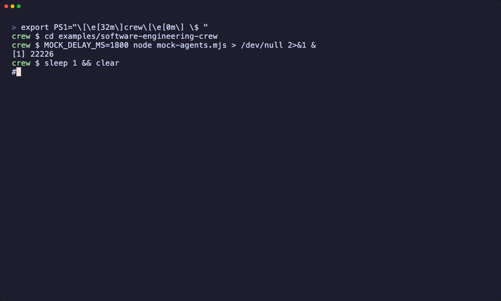

# Software Engineering Crew

> **New here?** Start with the [Copilot Quickstart](../copilot-quickstart/), which turns one agent into an A2A server. This example builds on it with several agents.

A small, real multi-agent workflow built on `a2a-wrapper`, all over the A2A protocol:

```
                     ┌────────────────────────┐
  feature request ─▶ │  Planner (planner.mjs) │
                     └───────────┬────────────┘
                 1. implement    │    2. test & review
              ┌──────────────────┴───────────────────┐
              ▼                                      ▼
   ┌─────────────────────┐               ┌─────────────────────┐
   │ Implementer         │               │ Tester              │
   │ a2a-claude  :3030   │  ── result ─▶ │ a2a-codex   :3020   │
   │ (Claude Code)       │               │ (OpenAI Codex)      │
   └─────────────────────┘               └─────────────────────┘
              └──────────── same workspace (git repo) ────────┘
```

1. The **planner** takes a feature request and sends it to Claude Code (`a2a-claude`).
2. Claude Code implements it in the shared workspace and returns a summary as an A2A artifact.
3. The planner hands that summary to Codex (`a2a-codex`), which writes tests, runs them, and fixes what it finds.
4. The planner prints the combined result.

The planner is ~100 lines of dependency-free Node that speaks plain A2A JSON-RPC (`message/send`). It could equally be any A2A-capable orchestrator; the point is that the two coding agents are interchangeable A2A peers.

## Try it without API keys (30 seconds)

```bash
git clone https://github.com/shashikanth-gs/a2a-wrapper.git
cd a2a-wrapper/examples/software-engineering-crew
node planner.mjs --mock "Add a slugify(text) helper"
```



`--mock` starts two in-process stand-in agents so you can see the flow. They make no LLM calls and change no files.

## Run it for real

**Requirements:** Node >= 20, an `ANTHROPIC_API_KEY`, an `OPENAI_API_KEY` (or `codex login` plus `CODEX_MODEL`).

> **Heads up:** these agents can edit files and run commands in `WORKSPACE_DIR`. Use a scratch repo, not one you care about. See the [Security Guide](../../docs/security.md).

```bash
# 1. From the repo root: install and build
npm install
npx turbo run build

# 2. A scratch git repo both agents share (Codex requires a git repository)
export WORKSPACE_DIR=$(mktemp -d)
git -C "$WORKSPACE_DIR" init && git -C "$WORKSPACE_DIR" commit --allow-empty -m init

# 3. Terminal A — the implementer (Claude Code) on :3030
export ANTHROPIC_API_KEY=sk-ant-...
cd a2a-claude && npm run dev -- --config agents/example/config.json

# 4. Terminal B — the tester (Codex) on :3020
export OPENAI_API_KEY=sk-...          # same WORKSPACE_DIR as above
cd a2a-codex && npm run dev -- --config agents/example/config.json

# 5. Terminal C — run the crew
cd examples/software-engineering-crew
node planner.mjs "Add a slugify(text) helper to src/slugify.js that lowercases and hyphenates"
```

When it finishes, look in `$WORKSPACE_DIR`: you should find the implementation and its tests.

Different ports or hosts? Set `IMPLEMENTER_URL` and `TESTER_URL`.

## How it works

- **Discovery** — the planner fetches `/.well-known/agent-card.json` from each agent before talking to it.
- **Delegation** — `message/send` with `configuration.blocking: true`, so the call returns when the task completes.
- **Artifacts** — each agent returns its answer as A2A artifacts; the planner reads their text parts.
- **Sessions** — one `contextId` is shared across both calls, so each agent can keep its own multi-turn history.

## Status

The `--mock` path runs with no external services. The real path depends on live model APIs and a funded account and is not covered by CI, so treat it as a working reference; please open an issue if it breaks for you.

## Ideas to extend it

- Add a third agent (`a2a-copilot` or `a2a-opencode`) as a reviewer.
- Loop until the tester reports passing tests.
- Swap the planner for LangGraph, Google ADK, or any other A2A client.
- For the no-LLM, sub-agents-as-MCP-tools variant, see [`a2a-subagents-scenario`](../a2a-subagents-scenario/).
